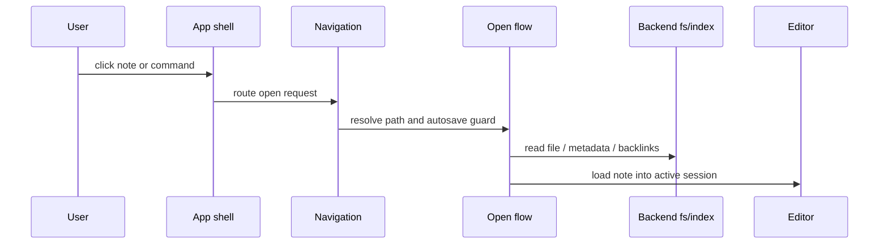
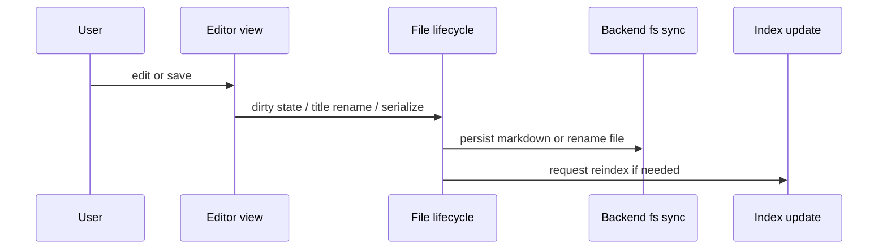
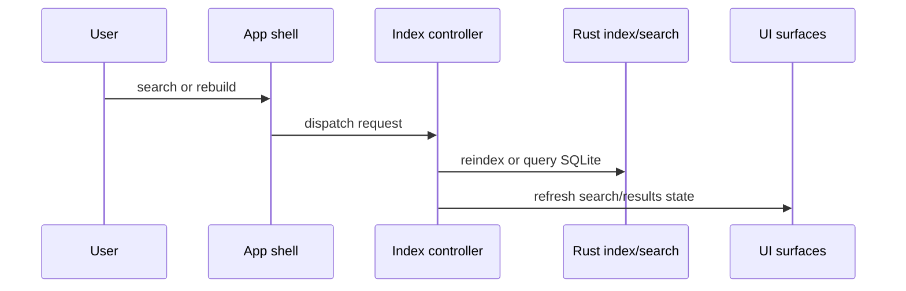
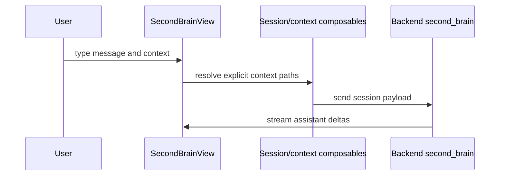
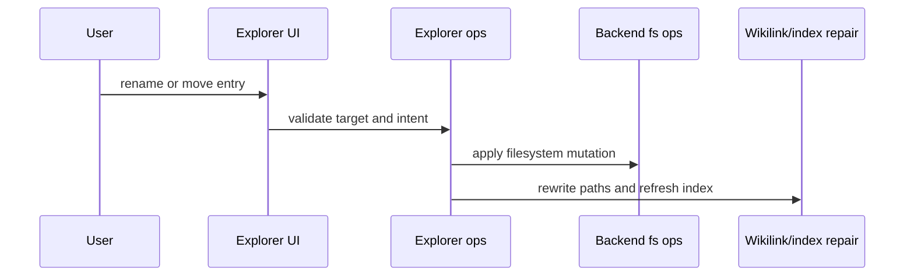

# Start Here

This guide is for someone who needs to understand and change Tomosona without rebuilding the whole mental model from scratch.

## What This Project Is

Tomosona is a local-first desktop app:

- `src/` is the Vue 3 frontend
- `src-tauri/` is the Rust backend behind Tauri
- `docs/` contains architecture and design notes

The main rule is simple:

- `app` owns shell orchestration
- `domains` own feature behavior
- `shared` owns reusable UI, API wrappers, and small utilities

If you keep that boundary intact, the code stays manageable.

## Read This In Order

1. `README.md`
2. `src/app/ARCHITECTURE.md`
3. `src/domains/editor/components/editor/ARCHITECTURE.md`
4. `src/domains/second-brain/components/ARCHITECTURE.md`
5. `src/domains/explorer/ARCHITECTURE.md`
6. `src-tauri/src/BACKEND_INDEX_ARCHITECTURE.md`
7. `src-tauri/src/second_brain/SECOND_BRAIN_ARCHITECTURE.md`
8. `docs/design/11_testing_guide.md`

That order goes from product shape to the main implementation seams.

## First 30 Minutes

If you are new to the codebase, do this in order:

1. Run `npm test` once to confirm the frontend test suite is healthy.
2. Run `cargo check` in `src-tauri` to confirm the backend still compiles.
3. Open `src/app/App.vue` and skim the imports only. That shows the shell surface area.
4. Open `src/domains/editor/components/editor/ARCHITECTURE.md` and `src/domains/second-brain/components/ARCHITECTURE.md` to see how the two densest UI surfaces are split.
5. Open `src-tauri/src/BACKEND_INDEX_ARCHITECTURE.md` and `src-tauri/src/second_brain/SECOND_BRAIN_ARCHITECTURE.md` to see where backend responsibilities live.
6. Pick one feature you care about and trace it through the smallest number of files possible.

If the code path is unclear, start from the tests for that feature. The tests are often a better map than the implementation files.

## Change Map

Use this as a quick routing table when you need to make a change.

| Change Type | Start Here | Main Follow-Ups |
| --- | --- | --- |
| Workspace boot / restore | `src/app/App.vue` | `src/app/composables/useAppShellWorkspaceLifecycle.ts`, `src/app/composables/useAppShellWorkspaceFsSync.ts`, `src/app/composables/useAppShellPersistence.ts`, `src/app/composables/useAppWorkspaceController.ts` |
| Workspace setup wizard | `src/app/components/app/WorkspaceSetupWizardModal.vue` | `src/app/composables/useAppShellWorkspaceSetup.ts`, `src/app/lib/workspaceSetupWizard.ts`, `src/app/ARCHITECTURE.md` |
| Open note | `src/app/composables/useAppShellOpenFlow.ts` | `src/app/composables/useAppNavigationController.ts`, `src/domains/editor/composables/*`, `src-tauri/src/fs_ops.rs` |
| Save note | `src/domains/editor/components/EditorView.vue` | `src/domains/editor/composables/useEditorFileLifecycle.ts`, `src/domains/editor/composables/useEditorDocumentRuntime.ts`, `src-tauri/src/editor_sync.rs` |
| Shell keyboard / command routing | `src/app/composables/useAppShellKeyboard.ts` | `src/app/composables/useAppShellCommands.ts`, `src/app/composables/useAppShellModalInteractions.ts` |
| Explorer rename / move | `src/domains/explorer/components/ExplorerTree.vue` | `src/domains/explorer/composables/useExplorerOperations.ts`, `src/domains/explorer/lib/explorerDndRules.ts`, `src-tauri/src/fs_ops.rs` |
| Search / indexing | `src-tauri/src/markdown_index.rs` | `src-tauri/src/search_index.rs`, `src-tauri/src/index_schema.rs`, `src/app/composables/useAppIndexingController.ts` |
| Cosmos graph behavior | `src/domains/cosmos/components/CosmosView.vue` | `src/domains/cosmos/composables/useCosmosController.ts`, `src-tauri/src/wikilink_graph.rs` |
| Second Brain chat flow | `src/domains/second-brain/components/SecondBrainView.vue` | `src/domains/second-brain/composables/useSecondBrainSessions.ts`, `src/domains/second-brain/composables/useSecondBrainDeliberation.ts`, `src-tauri/src/second_brain/*` |
| Second Brain config / models | `src/app/components/settings/SettingsModal.vue` | `src/shared/api/settingsApi.ts`, `src-tauri/src/second_brain/config.rs`, `src-tauri/src/second_brain/openai_codex.rs` |
| Alter manager | `src/domains/alters/components/AlterManagerView.vue` | `src/domains/alters/composables/useAlterManager.ts`, `src-tauri/src/alters.rs` |
| UI primitives / shared shells | `src/shared/components/ui/ARCHITECTURE.md` | `src/shared/components/ui/*`, `src/assets/tailwind.css` |

## How Things Fit Together

These are the main flows worth understanding first.

### Open Note



### Save Note



### Search / Index



### Second Brain Send



### Explorer Rename / Move



## Where To Start For A New Change

Use the smallest surface that actually owns the behavior.

### Shell / App

Use this when the change coordinates multiple domains:

- global shortcuts
- modals
- workspace boot/reset
- pane routing
- command palette actions

Start in:

- `src/app/App.vue`
- `src/app/composables/useApp*`

### Editor

Use this when the change is about note editing, title handling, overlays, or Tiptap behavior.

Start in:

- `src/domains/editor/components/EditorView.vue`
- `src/domains/editor/composables/useEditor*`
- `src/domains/editor/lib/*`

### Second Brain

Use this when the change touches chat sessions, context injection, streamed responses, or prompt composition.

Start in:

- `src/domains/second-brain/components/SecondBrainView.vue`
- `src/domains/second-brain/composables/useSecondBrain*`
- `src/domains/second-brain/lib/*`

### Explorer

Use this when the change is about tree rendering, selection, drag and drop, rename, or file moves.

Start in:

- `src/domains/explorer/components/*`
- `src/domains/explorer/composables/*`
- `src/domains/explorer/lib/*`

### Backend

Use this when the change touches filesystem access, indexing, search, persistence, or Tauri commands.

Start in:

- `src-tauri/src/lib.rs`
- `src-tauri/src/fs_ops.rs`
- `src-tauri/src/markdown_index.rs`
- `src-tauri/src/search_index.rs`
- `src-tauri/src/index_schema.rs`
- `src-tauri/src/second_brain/*`

## Common Workflows

### Open a note

The note-open path usually goes through:

- shell command routing in `src/app/App.vue`
- navigation workflow in `src/app/composables/useAppNavigationController.ts`
- open flow orchestration in `src/app/composables/useAppShellOpenFlow.ts`
- editor/session loading in `src/domains/editor/composables/*`
- backend file access in `src-tauri/src/fs_ops.rs`

If a bug affects open latency or stale note state, look there first.

### Save a note

The save path usually crosses:

- `EditorView.vue`
- editor lifecycle composables
- workspace filesystem sync in the backend

If title-based renames or conflict handling are involved, treat that as a workflow bug, not a UI bug.

### Change Second Brain behavior

Second Brain is split across:

- shell wiring in `App.vue`
- frontend chat surface in `SecondBrainView.vue`
- frontend session/context composables
- backend session store, prompt builder, and message flow

If the change affects explicit context or streaming, check both frontend and backend.

### Change search or indexing

Search and indexing are backend-heavy:

- `src-tauri/src/markdown_index.rs`
- `src-tauri/src/search_index.rs`
- `src-tauri/src/index_schema.rs`
- `src-tauri/src/wikilink_graph.rs`

The frontend should usually only consume typed API wrappers and display state.

## What Not To Do

- Do not add cross-cutting logic directly into `App.vue` if a shell composable can own it.
- Do not put domain behavior into `shared/`.
- Do not add new IPC calls directly in arbitrary Vue components when a typed API wrapper already exists.
- Do not duplicate path normalization rules in frontend and backend.
- Do not add another abstraction layer unless the current one is actually forcing duplication.

## Useful Commands

Frontend:

```bash
npm run dev
npm run build
npm test
```

Desktop app:

```bash
npm run tauri:dev
npm run tauri:build
```

Backend only:

```bash
cargo check
```

## If You Are Unsure

Prefer these questions in order:

1. Which domain owns this behavior?
2. Is this a shell orchestration problem instead?
3. Is the logic pure enough to extract into `lib/` or `shared/`?
4. Does this need a test before or after the change?

If you can answer those four questions, you can usually change the code safely.
