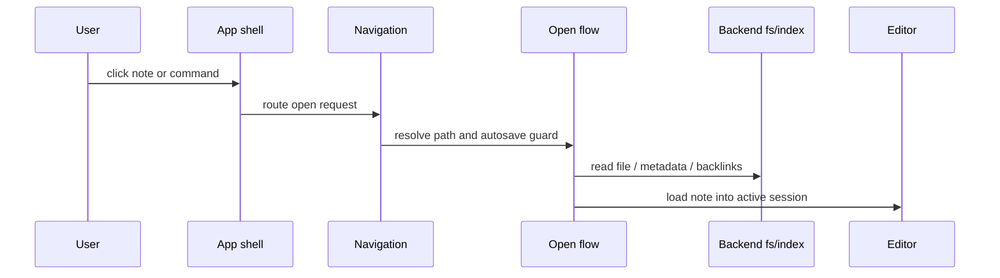
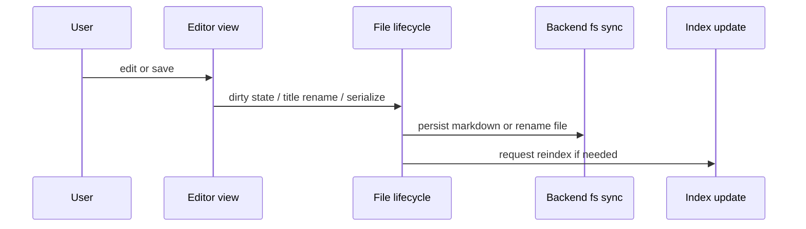
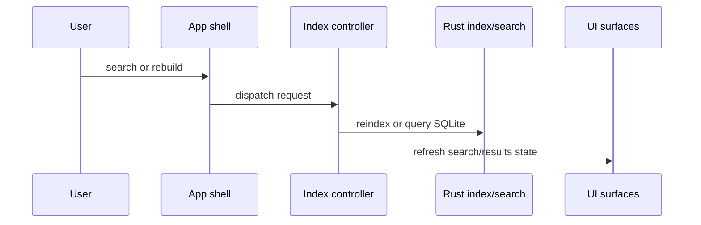
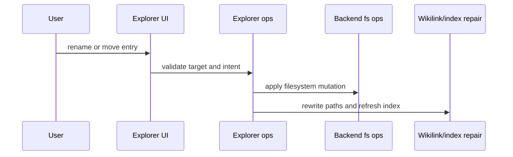

# Start Here

This guide is for someone who needs to understand and change Tomosona without rebuilding the whole mental model from scratch.

## What This Project Is

Tomosona is a local-first desktop app:

- `src/` is the Vue 3 frontend
- `src-tauri/` is the Rust backend behind Tauri
- `docs/` contains architecture and design notes

The main rule is simple:

- `app` owns shell orchestration
- `domains` own feature behavior
- `shared` owns reusable UI, API wrappers, and small utilities

If you keep that boundary intact, the code stays manageable.

## How To Read The Docs

The architecture notes are only useful if they answer the same three questions every time:

- Who owns this state or workflow?
- Why does this module exist instead of living somewhere larger?
- What boundary must not be crossed?

If a module or doc does not answer those questions, treat it as incomplete and prefer the smaller owner.

## Read This In Order

1. `README.md`
2. `src/app/ARCHITECTURE.md`
3. `src/domains/editor/components/editor/ARCHITECTURE.md`
4. `src/domains/explorer/ARCHITECTURE.md`
5. `src-tauri/src/BACKEND_INDEX_ARCHITECTURE.md`
6. `docs/design/11_testing_guide.md`

That order goes from product shape to the main implementation seams.

## First 30 Minutes

If you are new to the codebase, do this in order:

1. Run `npm test` once to confirm the frontend test suite is healthy.
2. Run `cargo check` in `src-tauri` to confirm the backend still compiles.
3. Open `src/app/App.vue` and skim the imports only. That shows the shell surface area and the current surface wrappers (`AppShellChromeSurface`, `AppShellWorkspaceSurface`, `AppShellOverlays`).
4. Open `src/domains/editor/components/editor/ARCHITECTURE.md` to see how the densest UI surface is split.
5. Open `src-tauri/src/BACKEND_INDEX_ARCHITECTURE.md` to see where backend responsibilities live.
6. Pick one feature you care about and trace it through the smallest number of files possible.

If the code path is unclear, start from the tests for that feature. The tests are often a better map than the implementation files.

## Change Map

Use this as a quick routing table when you need to make a change.

| Change Type | Start Here | Main Follow-Ups |
| --- | --- | --- |
| Workspace boot / restore | `src/app/App.vue` | `src/app/composables/useAppShellWorkspaceLifecycle.ts`, `src/app/composables/useAppShellWorkspaceFsSync.ts`, `src/app/composables/useAppShellPersistence.ts`, `src/app/composables/useAppWorkspaceController.ts` |
| App runtime bootstrap / teardown | `src/app/composables/useAppShellRuntimeLifecycle.ts` | `src/app/App.vue`, `src/app/composables/useAppShellWorkspaceLifecycle.ts`, `src/app/composables/useAppShellPersistence.ts` |
| Shell chrome controls | `src/app/composables/useAppShellChromeRuntime.ts` | `src/app/App.vue`, `src/app/composables/useAppShellHistoryUi.ts`, `src/app/composables/useAppShellPersistence.ts` |
| Shell presentation surfaces | `src/app/components/app/AppShellChromeSurface.vue`, `src/app/components/app/AppShellWorkspaceSurface.vue`, `src/app/components/app/AppShellOverlays.vue` | `src/app/App.vue`, `src/app/components/app/TopbarNavigationControls.vue`, `src/app/components/app/SidebarSurface.vue`, `src/app/components/app/WorkspaceStatusBar.vue`, `src/app/components/app/*Modal.vue` |
| Constituted context actions | `src/app/composables/useAppShellConstitutedContextActions.ts` | `src/app/App.vue`, `src/domains/editor/composables/useConstitutedContext.ts` |
| Pane/editor runtime glue | `src/app/composables/useAppShellPaneRuntime.ts` | `src/app/App.vue`, `src/app/composables/useAppNavigationController.ts`, `src/app/composables/useAppShellCommands.ts` |
| Pure shell helpers | `src/app/lib/appShellDocuments.ts`, `src/app/lib/appShellPane.ts`, `src/app/lib/appShellPathMoveEffects.ts` | `src/app/App.vue`, `src/app/composables/useAppShellPaneRuntime.ts`, `src/app/composables/useAppShellCommands.ts` |
| Workspace entry routing | `src/app/composables/useAppShellWorkspaceRouting.ts` | `src/app/composables/useAppShellWorkspaceLifecycle.ts`, `src/app/composables/useAppShellWorkspaceSetup.ts`, `src/app/composables/useAppShellModals.ts`, `src/app/ARCHITECTURE.md` |
| Workspace setup wizard | `src/app/components/app/WorkspaceSetupWizardModal.vue` | `src/app/composables/useAppShellWorkspaceSetup.ts`, `src/app/lib/workspaceSetupWizard.ts`, `src/app/ARCHITECTURE.md` |
| New note modal / template picker | `src/app/components/app/WorkspaceEntryModals.vue` | `src/app/App.vue`, `src/app/lib/newNoteTemplates.ts`, `src/app/composables/useAppShellWorkspaceRouting.ts` |
| Open note | `src/app/composables/useAppShellOpenFlow.ts` | `src/app/composables/useAppNavigationController.ts`, `src/domains/editor/composables/*`, `src-tauri/src/fs_ops.rs` |
| Save note | `src/domains/editor/components/EditorView.vue` | `src/domains/editor/composables/useEditorFileLifecycle.ts`, `src/domains/editor/composables/useEditorDocumentRuntime.ts`, `src-tauri/src/editor_sync.rs` |
| Note history / restore | `src/domains/editor/components/EditorView.vue` | `src/domains/editor/components/editor/EditorNoteHistoryDialog.vue`, `src/shared/api/noteHistoryApi.ts`, `src/app/composables/useWorkspaceMutationEffects.ts` |
| Editor `@` macro insertion | `src/domains/editor/components/editor/EditorAtMenu.vue` | `src/domains/editor/lib/editorAtMacros.ts`, `src/domains/editor/composables/useEditorInputHandlers.ts`, `src/domains/editor/composables/useEditorChromeRuntime.ts` |
| Root note persistence | `src/app/composables/useAppNotePersistence.ts` | `src/app/App.vue`, `src/app/composables/useAppWorkspaceController.ts`, `src/shared/api/editorSyncApi.ts` |
| Shell keyboard / command routing | `src/app/composables/useAppShellKeyboard.ts` | `src/app/composables/useAppShellCommands.ts`, `src/app/composables/useAppShellPaletteActions.ts`, `src/app/composables/useAppShellModalInteractions.ts` |
| Command palette catalog | `src/app/composables/useAppShellPaletteActions.ts` | `src/app/composables/useAppShellCommands.ts`, `src/app/composables/useAppShellModalInteractions.ts`, `src/app/ARCHITECTURE.md` |
| Shell entrypoint bridge | `src/app/composables/useAppShellEntryActions.ts` | `src/app/composables/useAppShellLaunchpad.ts`, `src/app/composables/useAppShellPaletteActions.ts`, `src/app/ARCHITECTURE.md` |
| Launchpad quick-start routing | `src/app/components/panes/WorkspaceLaunchpad.vue` | `src/app/composables/useAppShellLaunchpad.ts`, `src/app/composables/useAppShellCommands.ts`, `src/app/ARCHITECTURE.md` |
| Explorer rename / move | `src/domains/explorer/components/ExplorerTree.vue` | `src/domains/explorer/composables/useExplorerOperations.ts`, `src/domains/explorer/lib/explorerDndRules.ts`, `src-tauri/src/fs_ops.rs` |
| Search / indexing | `src-tauri/src/markdown_index.rs` | `src-tauri/src/search_index.rs`, `src-tauri/src/index_schema.rs`, `src/app/composables/useAppIndexingController.ts` |
| UI primitives / shared shells | `src/shared/components/ui/ARCHITECTURE.md` | `src/shared/components/ui/*`, `src/assets/tailwind.css` |

## How Things Fit Together

These are the main flows worth understanding first.

### Open Note


```mermaid
sequenceDiagram
  participant U as User
  participant A as App shell
  participant N as Navigation
  participant O as Open flow
  participant F as Backend fs/index
  participant E as Editor

  U->>A: click note or command
  A->>N: route open request
  N->>O: resolve path and autosave guard
  O->>F: read file / metadata / backlinks
  O->>E: load note into active session
```

### Save Note


```mermaid
sequenceDiagram
  participant U as User
  participant E as Editor view
  participant L as File lifecycle
  participant F as Backend fs sync
  participant I as Index update

  U->>E: edit or save
  E->>L: dirty state / title rename / serialize
  L->>F: persist markdown or rename file
  L->>I: request reindex if needed
```

### Search / Index


```mermaid
sequenceDiagram
  participant U as User
  participant A as App shell
  participant C as Index controller
  participant R as Rust index/search
  participant S as UI surfaces

  U->>A: search or rebuild
  A->>C: dispatch request
  C->>R: reindex or query SQLite
  C->>S: refresh search/results state
```

### Explorer Rename / Move


```mermaid
sequenceDiagram
  participant U as User
  participant X as Explorer UI
  participant O as Explorer ops
  participant F as Backend fs ops
  participant W as Wikilink/index repair

  U->>X: rename or move entry
  X->>O: validate target and intent
  O->>F: apply filesystem mutation
  O->>W: rewrite paths and refresh index
```

## Where To Start For A New Change

Use the smallest surface that actually owns the behavior.

### Shell / App

Use this when the change coordinates multiple domains:

- global shortcuts
- modals
- workspace boot/reset
- pane routing
- command palette actions

Start in:

- `src/app/App.vue`
- `src/app/composables/useApp*`

### Editor

Use this when the change is about note editing, title handling, overlays, `@` macros, note history, or Tiptap behavior.

Start in:

- `src/domains/editor/components/EditorView.vue`
- `src/domains/editor/composables/useEditor*`
- `src/domains/editor/lib/*`

### Explorer

Use this when the change is about tree rendering, selection, drag and drop, rename, or file moves.

Start in:

- `src/domains/explorer/components/*`
- `src/domains/explorer/composables/*`
- `src/domains/explorer/lib/*`

### Backend

Use this when the change touches filesystem access, indexing, search, persistence, or Tauri commands.

Start in:

- `src-tauri/src/lib.rs`
- `src-tauri/src/fs_ops.rs`
- `src-tauri/src/markdown_index.rs`
- `src-tauri/src/search_index.rs`
- `src-tauri/src/index_schema.rs`

## Common Workflows

### Open a note

The note-open path usually goes through:

- shell command routing in `src/app/App.vue`
- navigation workflow in `src/app/composables/useAppNavigationController.ts`
- open flow orchestration in `src/app/composables/useAppShellOpenFlow.ts`
- editor/session loading in `src/domains/editor/composables/*`
- backend file access in `src-tauri/src/fs_ops.rs`

If a bug affects open latency or stale note state, look there first.

### Create a note

The new-note path usually goes through:

- shell entrypoint routing in `src/app/App.vue`
- the new note modal in `src/app/components/app/WorkspaceEntryModals.vue`
- the template catalog in `src/app/lib/newNoteTemplates.ts`
- shell filesystem create flows and workspace refresh logic

If template selection looks wrong, start with the catalog builder and the modal state, not the file creation code.

### Save a note

The save path usually crosses:

- `EditorView.vue`
- editor lifecycle composables
- workspace filesystem sync in the backend

If title-based renames or conflict handling are involved, treat that as a workflow bug, not a UI bug.

### Restore note history

The restore path usually crosses:

- `src/domains/editor/components/EditorView.vue`
- `src/domains/editor/components/editor/EditorNoteHistoryDialog.vue`
- `src/shared/api/noteHistoryApi.ts`
- `src/app/composables/useWorkspaceMutationEffects.ts`

If restored snapshots disappear or move after rename, check the workspace mutation effects first.

### Change search or indexing

Search and indexing are backend-heavy:

- `src-tauri/src/markdown_index.rs`
- `src-tauri/src/search_index.rs`
- `src-tauri/src/index_schema.rs`
- `src-tauri/src/wikilink_graph.rs`

The frontend should usually only consume typed API wrappers and display state.

## What Not To Do

- Do not add cross-cutting logic directly into `App.vue` if a shell composable can own it.
- Do not put domain behavior into `shared/`.
- Do not add new IPC calls directly in arbitrary Vue components when a typed API wrapper already exists.
- Do not duplicate path normalization rules in frontend and backend.
- Do not add another abstraction layer unless the current one is actually forcing duplication.

## Useful Commands

Frontend:

```bash
npm run dev
npm run build
npm test
```

Desktop app:

```bash
npm run tauri:dev
npm run tauri:build
```

Backend only:

```bash
cargo check
```

## If You Are Unsure

Prefer these questions in order:

1. Which domain owns this behavior?
2. Is this a shell orchestration problem instead?
3. Is the logic pure enough to extract into `lib/` or `shared/`?
4. Does this need a test before or after the change?

If you can answer those four questions, you can usually change the code safely.
